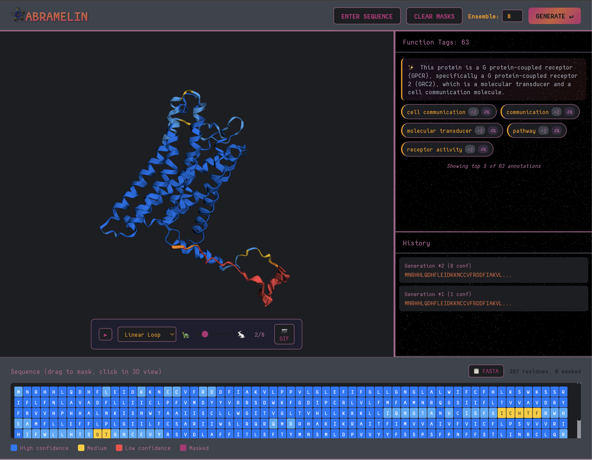

<div align="center">
  

  <a href="#quickstart">Quickstart</a> ·
  <a href="#web-interface">Web Interface</a> ·
  <a href="#mlx-acceleration">MLX Acceleration</a> ·
  <a href="#features">Features</a>
</div>

---

A fork of [EvolutionaryScale's ESM3](https://github.com/evolutionaryscale/esm) optimized for **Apple Silicon** with an interactive web interface for protein design. Generate sequences, predict structures, and explore conformational ensembles—all running locally on your Mac.

## Quickstart

```bash
# Install dependencies
pip install -e .

# Launch the web interface
python -m esm.web.app
# Open http://localhost:8000
```

## Web Interface

<div align="center">
  
</div>

The Abramelin interface provides:

- **3D Protein Viewer** — Interactive 3Dmol.js visualization with pLDDT coloring
- **Sequence Bar** — Drag-to-mask residue selection with bi-directional sync
- **Ensemble Animation** — Smooth morphing between conformations with Kabsch alignment
- **Function Prediction** — InterPro annotations with LLM-powered summaries
- **GIF Export** — Share your protein animations

### Controls

| Action | Description |
|--------|-------------|
| `ENTER SEQUENCE` | Input or paste a protein sequence |
| `_` in sequence | Mask positions for generation |
| Drag on sequence bar | Select residues to mask |
| Click on 3D view | Toggle residue masking |
| `GENERATE` / `↵` | Run ESM3 generation |
| Ensemble slider | Generate multiple conformations |

## MLX Acceleration

This fork replaces PyTorch with [MLX](https://github.com/ml-explore/mlx) for native Apple Silicon acceleration:

```python
from esm.models.mlx import ESM3MLX
from esm.sdk.api import ESMProtein, GenerationConfig

model = ESM3MLX.from_pretrained("esm3-open")

# Mask unknown positions with underscores
protein = ESMProtein(sequence="MKTAY____QRQISFVK")

# Generate sequence
protein = model.generate(protein, GenerationConfig(track="sequence", num_steps=8))

# Generate structure
protein = model.generate(protein, GenerationConfig(track="structure", num_steps=8))

# Save result
protein.to_pdb("output.pdb")
```

### Performance (M4 Max, 260 residues)

| Operation | Time |
|-----------|------|
| Sequence generation (8 steps) | ~11s |
| Structure generation (8 steps) | ~4.5s |
| **Total** | **~16s** |

## Features

### Ensemble Generation
Generate multiple conformations to explore protein flexibility:
```python
from esm.web.app import generate_ensemble

ensemble = await generate_ensemble(
    sequence="MKTAY____QRQISFVK",
    num_conformations=8,
    websocket=ws
)
```

### Function Prediction
Predict InterPro annotations and functional keywords:
```python
annotations = model.predict_function(protein)
# Returns: [FunctionAnnotation(label="DNA-binding", start=10, end=45), ...]
```

### LLM-Powered Summaries
Automatically summarize function annotations using a local LLM (Llama 3.2):
```python
from esm.web.app import summarize_function_annotations

summary = summarize_function_annotations(top_labels, seq_length)
# "This protein is a zinc finger transcription factor..."
```

## Architecture

```
esm/
├── models/
│   └── mlx/
│       ├── esm3_mlx.py      # Main MLX model (drop-in replacement)
│       ├── layers.py        # Transformer layers with mx.fast.* kernels
│       └── fused_ops.py     # Fused SwiGLU, LayerNorm+Linear
└── web/
    ├── app.py               # FastAPI server with WebSocket streaming
    └── static/
        ├── js/
        │   ├── app.js       # Main application controller
        │   ├── viewer3d.js  # 3Dmol wrapper with Kabsch alignment
        │   ├── sequenceBar.js
        │   ├── maskSync.js  # Bidirectional mask state
        │   └── websocket.js
        └── css/
            └── alchemy.css  # Golden ratio layout
```

## Key Differences from Upstream ESM3

| Feature | Original ESM3 | Abramelin |
|---------|---------------|-----------|
| Framework | PyTorch | MLX (Apple Silicon) |
| Interface | Python API | Web UI + Python API |
| Structure | Single prediction | Ensemble generation |
| Animation | N/A | Kabsch-aligned morphing |
| Function | Prediction only | Prediction + LLM summary |

## Documentation

- [MLX Acceleration Details](docs/MLX_ACCELERATION.md)
- [Development Progress](docs/PROGRESS.md)
- [Original ESM3 Paper](https://www.science.org/doi/10.1126/science.ads0018)

## Credits

This project builds upon:

- **[ESM3](https://github.com/evolutionaryscale/esm)** by EvolutionaryScale — The foundational protein language model
- **[MLX](https://github.com/ml-explore/mlx)** by Apple — Apple Silicon ML framework
- **[3Dmol.js](https://3dmol.csb.pitt.edu/)** — Molecular visualization
- **[gif.js](https://jnordberg.github.io/gif.js/)** — GIF encoding

## Citation

If you use Abramelin in your work, please cite:

```bibtex
@software{abramelin2025,
  author = {Taghon, Geoffrey},
  title = {Abramelin: ESM3 Protein Alchemy on Apple Silicon},
  year = {2025},
  url = {https://github.com/gtaghon/abramelin}
}

@article{hayes2024simulating,
  author = {Hayes, Thomas and Rao, Roshan and Akin, Halil and others},
  title = {Simulating 500 million years of evolution with a language model},
  journal = {Science},
  year = {2025},
  doi = {10.1126/science.ads0018}
}
```

## License

See [LICENSE.md](./LICENSE.md) for details. This fork inherits the ESM3 license from EvolutionaryScale.

---

<div align="center">
  <sub>Built with MLX on  Apple Silicon</sub>
</div>
